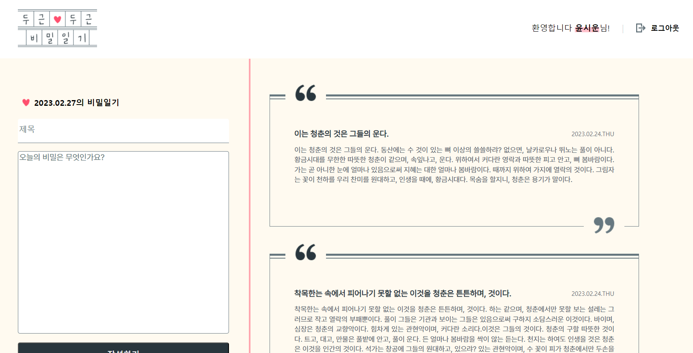
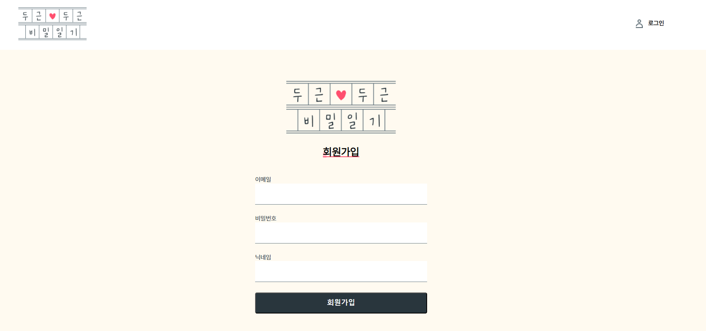

    

<h1>📝두근두근 다이어리 클론코딩!</h1>
사용 기술 스택 
<ul>
<li></li>
<li></li>
</ul> 
<h2>✍ 프로젝트 UI</h2>
main_page
 
join_page
 

<h2>history</h2>
<ol>
<li>html 마크업 과제 및 코드 작성</li>
<li>24.08.14 - CSS 적용 </li>
<li>24.08.22 - Flex함수 등을 적용하기위해 마크업/스타일 전부 리팩토링 </li>
<ul>
  <li>figma가 제공하는 margin / paddig을 이용하여 레이아웃 스타일 적용</li>
  <li>reset.css 속성값 추가로 중복 속성 제거</li>
  <li>중복 속성 코드 common.css 파일으로 분리</li>
  <li>등</li>
</ul>
</ol>
